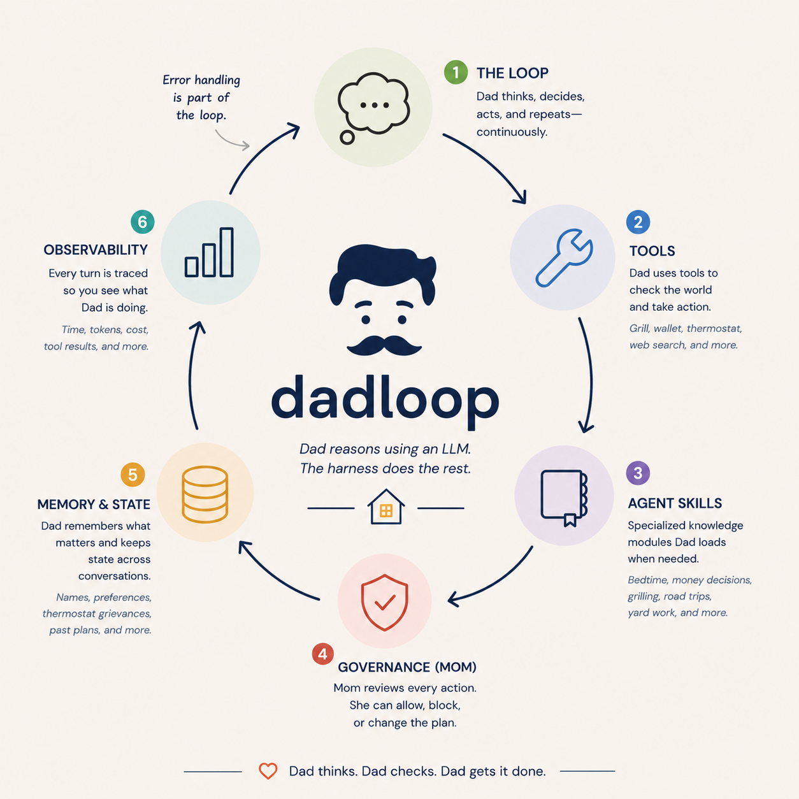
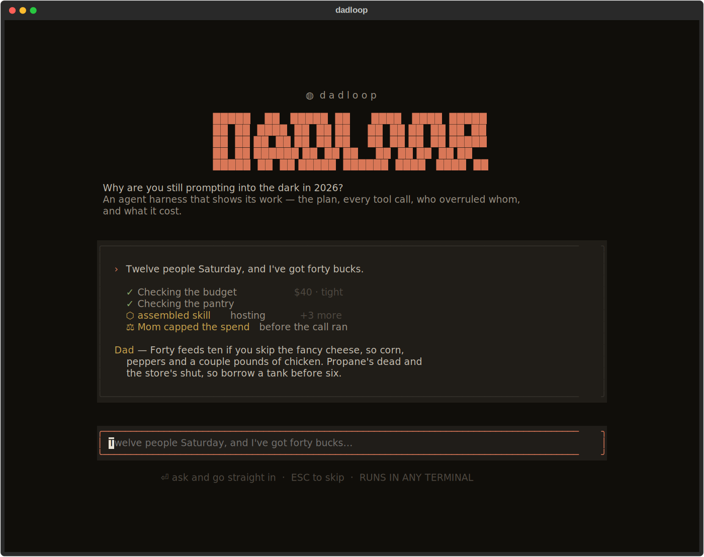
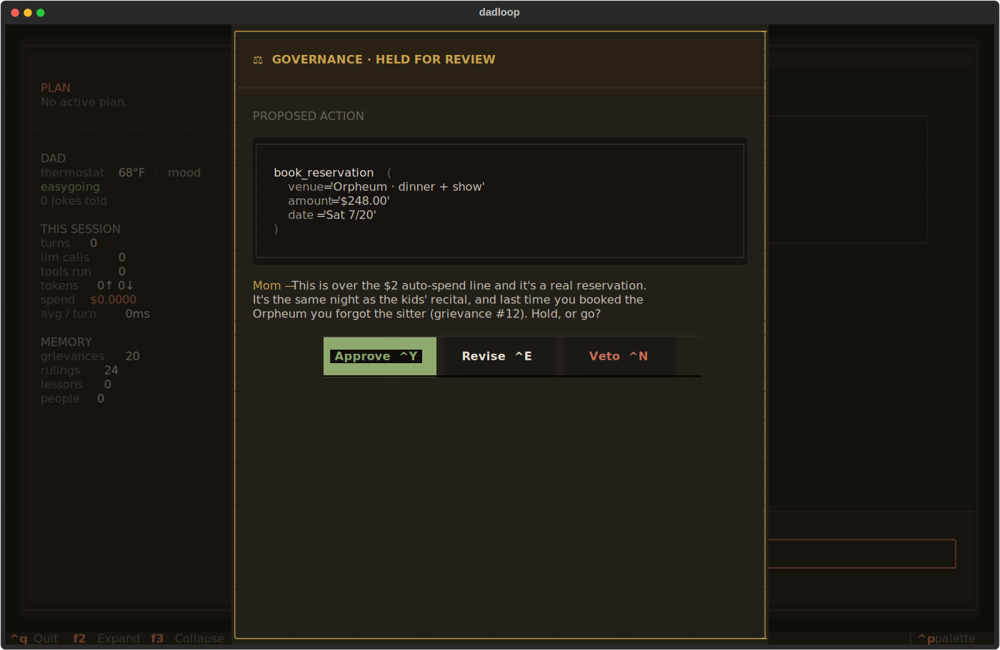

# dadloop
An agent harness, explained through the most capable system you already understand: Dad.

## Why I built this
When asked what is an "agent harness", everyone repeats the same equation: "Agent = Model + Harness". Gets explained as everything that isn't the model. That has always bothered me. It's a lazy kitchen-sink definition. It tells us what a harness isn't, but almost nothing about what it actually does. If we're going to talk about agent harnesses, we should be able to explain what they actually are.

So I built dadloop: a minimal, executable agent harness that makes those pieces visible. Its domain happens to be a suburban dad, because everyone already knows the rules, controlled by mom. dadloop is also my homage to [pi.dev](https://pi.dev) — small core, tools as the model's hands, memory you own, no framework in the way.

<p align="center">

</p>

## Install

Requires Python 3.10+ and an [Anthropic API key](https://console.anthropic.com).

```bash
git clone https://github.com/you/dadloop && cd dadloop
pip install -e .
cp .env.example .env    # add your key to this file
```

## Usage

```bash
dadloop                   # terminal UI
dadloop --repl            # plain REPL
python -m dadloop.demos   # five scripted scenarios
```

`ctrl+q` quits. Every other key is shown in the footer.

## What it looks like

Ask him something that has to be worked out, not just answered:

```
Twelve people Saturday, and I've got forty bucks.
```

He states a plan, then loads `hosting`, which pulls in `money-decisions`, `grilling`, and `yard-work`. The menu he'd default to costs more than the budget allows. Mom caps the spend before the call runs. Something has to give, and the priority order in the skill decides what — budget wins, then timing, then menu.

Every one of those moves is on screen: the plan checking off, each tool call openable, Mom's veto as a card, the token cost at the bottom. Swap the cookout for a procurement request and none of the machinery changes.

<p align="center">

</p>

## What it is made of

Six core sub-systems, and that is the whole harness.

| part | what it does | file |
|---|---|---|
| **Loop** | the model picks a tool, sees the result, decides again, stops when done | `core/agent.py` |
| **Tools** | twelve verbs. Some report facts, some report problems to work around | `core/tools.py` |
| **Skills** | fifteen Markdown procedures, loaded on demand. `hosting` composes three others | `skills/*.md` |
| **Governance** | Mom. Every call clears a policy layer that can allow, block, or rewrite it | `core/controller.py` |
| **Memory** | grievances, lessons, rulings, people — persisted, and re-injected each turn | `core/memory.py` |
| **Observability** | tokens, dollar cost, and the split between model time and tool time | `core/trace.py` |

The twelve tools: `check_weather` `check_grill` `check_pantry` `check_hardware_store` `check_wallet` `set_thermostat` `find_tool` `web_search` `remember` `recall` `load_skill` `tell_joke`

The fifteen skills: `answering-big-questions` `bedtime` `breaking-up-fights` `comforting-a-kid` `fixing-things` `grilling` `grocery-runs` `hosting` `money-decisions` `road-trips` `saying-no` `snow-shoveling` `teaching-kids-stuff` `the-thermostat` `yard-work`

Skills only put their one-line descriptions in the prompt; bodies load on demand, so fifteen cost about a quarter of pasting them all in. Blocked calls are still written to memory — the job outlives the session, so the harness carries the refusals across restarts, or long-horizon work is impossible.

<p align="center">

</p>

Every tool is listed in [docs/architecture.md](docs/architecture.md); every skill in [docs/skills.md](docs/skills.md).

## Dad, and the constitution Mom holds him to

Dad is not a persona bolted on for charm. He runs on a written constitution, injected every turn — thirteen rules in three parts:

- **Grounding** — who he is, where home is, and what today's date and time actually are, so "tonight" and "this weekend" resolve to something real.
- **Values** — steady and clever; say what's true, not what's easy to hear; provide and do, don't lecture.
- **Process** — state the plan before touching a tool; check the world before ruling on it; load the skill before improvising; notice what's going on for the person before answering.
- **Voice** — lead with the decision, then earn it. Four sentences carry an answer, a fifth can carry the care. Don't narrate your own tool calls — the canvas already shows them; say what they *mean*. Warmth is not wordiness; brevity is not coldness.

Mom holds the pen. She owns amendments Dad cannot override, and three rules are not prompt text at all — they are code:

| rule | what happens |
|---|---|
| Thermostat cap | 74F summer, 70F winter, by the calendar. Ask for 78 in July and the call never executes. |
| Spend ceiling | $100 on any purchase. Dad can intend to say yes; the call is rewritten on the way out. |
| Five sentences | A long reply is trimmed before you see it — but a line carrying real acknowledgment is protected from the cut, not lopped off for coming last. |

Governance is not a disclaimer in the system prompt. It is a layer above the model that can overrule it.

## The work surface

The TUI is where the harness shows its work. It is the work surface. Any part of a turn is auditable without leaving it.

It opens on a launch screen that is also the first prompt — type your question there and press Enter, and it carries straight into the work surface and starts the turn. Escape skips it; `DADLOOP_NO_LAUNCH=1` turns it off for good.

<p align="center">

</p>

- **Canvas** — every tool call is a collapsible step: the arguments passed, the result returned. Skills appear as he pulls them, so a four-skill reconciliation reads as four visible moves. `Tab` walks them, `Enter` opens one, `f2`/`f3` open and close them all.
- **Plan panel** — Dad's stated plan, checking off as calls resolve. A call that was *not* in the plan is appended and marked unplanned, so intent and behavior stay side by side.
- **Governance surface** — when Mom *holds* a call for review, the loop pauses behind a bordered card naming the proposed action and her reasoning. Lighter touches — a rewritten argument, a trimmed reply — land inline as review cards. Either way the call, the verdict, and the reason are on screen, not a log line.
- **Scoreboard** — session totals (turns, tools, tokens, cost, latency), what Dad has accomplished across every session (calls settled, lessons learned, problems carried forward), and a ranking of the skills this household actually reaches for.
- **Admin view** (`f4`) — the harness inspecting itself: tools and schemas, skills and which are loaded, the constitution, Mom's live policies, the memory files on disk, the telemetry.

The shell is framed by default — an inset card on a darker backdrop. A terminal has no drop shadows and no rounded outer corner, so if you would rather have the space back, `DADLOOP_SHELL=full python -m dadloop` drops the frame and runs edge to edge.

<p align="center">

</p>

When Mom holds an action, the loop pauses and the proposed call is put up for review:

<p align="center">

</p>

## Other things it has to survive

The cookout is one shape. Here are the others.

**A dead end.** *"Grill's not lighting and people are coming at six."* Propane is empty, so refill it — except the hardware store is closed. Both facts are true and together they shut the obvious door. A coding agent gets a stack trace here; a domain agent has to find a third way.

**An outside fact against an internal limit.** *"What's a propane swap run these days?"* Nothing in the house knows, so he searches the live web, then checks the answer against the real budget.

**A job that spans sessions.** Ask for 78 degrees in July. Governance denies it, and the blocked attempt is filed anyway. Come back tomorrow, ask about something else, and it surfaces unprompted. Nothing that matters in domain work finishes in one sitting.

**Being overruled.** *"Can we just get the nice grill? It's like $400."* Dad does not get the final word. The spend cap runs before the tool executes, so the call is rewritten on the way out no matter what he intended.

## What's new

**A launch screen you can start from.** dadloop opens on a landing page rather than an empty canvas — wordmark, headline, and a sample turn showing a real constraint being reconciled. The prompt on it is live: type the first thing you want worked out, press Enter, and it carries into the work surface and runs. Escape skips it; `DADLOOP_NO_LAUNCH=1` turns it off.

**Every reply says what it did.** Dad's answer now carries an `ACTION TAKEN` line above it — checks run, skills assembled, and any call Mom blocked or rewrote. His reply says what he concluded; this says what the harness actually did on your behalf, which for something that can spend money and set the thermostat deserves its own line.

**The rail keeps score across sessions.** Two new panels: **Accomplishments** — calls settled, lessons learned, problems carried forward — and **Top skills**, a ranked bar chart of which playbooks this household actually reaches for. Skill loads are now written to disk, so the ranking describes months of use rather than the last ten minutes.

**Redesigned work surface.** New warm near-black palette with one coral accent and muted semantic colors — olive for what went right, gold for skills assembling and for Mom holding a call, rust reserved for real trouble. Tool calls now read as a tight rail of single lines (`✓ Checking the budget · amount=40 · 210ms`) instead of stacked cards, so a seven-tool turn scans in one glance. New title bar, live status line, an active-step highlight in the plan panel, and a governance-hold modal for held actions. The shell is framed by default; `DADLOOP_SHELL=full` runs edge to edge.

**Dad knows where and when he is.** He has a name, a home city, and the actual date and time, injected every turn. "What's playing tonight" and "is it warm enough Saturday" now resolve against a real clock and a real place instead of being deflected to "check your local listings."

**Real weather and real search.** `check_weather` hits the live web rather than a mocked constant, defaulting to home and accepting any location. `web_search` passes the current date and city into the lookup, so time-sensitive questions — showtimes, hours, events, prices — come back with actual specifics.

**Tighter replies.** Two new voice rules: don't narrate tool calls the canvas already shows, and be specific where it counts ("a tank from the neighbor before six" beats "sort out the propane"). The reply cap moved to five sentences so a complete thought isn't clipped mid-argument.

**Runs on any Textual version.** Theme tokens are substituted into the stylesheet before Textual parses it, fixing an `undefined variable` crash on older releases. A regression test now fails if a token ever leaks.

## Documentation

- [Architecture](docs/architecture.md) — the loop, tools, skills, governance, memory, tracing
- [Writing skills](docs/skills.md) — how to add one, and how they compose
- [Contributing](docs/contributing.md) — tests, lint, adding tools and policies

## Troubleshooting

**`APIConnectionError` on Windows while curl works.** Python is not trusting your organization's root CA. Run `pip install pip-system-certs`.

## License

MIT
Swami Chandrasekaran
